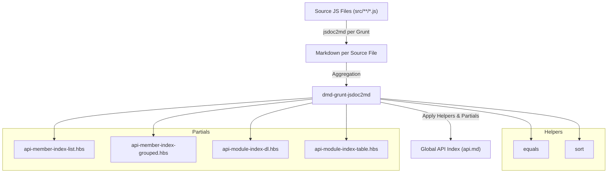

# dmd-grunt-jsdoc2md Pipeline Übersicht

## Beschreibung der Pipeline

1. Source JS Files
   - Alle Quellcodes im src/ Verzeichnis (src/**/*.js)
2. Grunt + jsdoc2md
   - Erzeugt pro Sourcefile ein Markdown-File
   - Optional: mehrere Formate, je nach Grunt-Konfiguration
3. dmd-grunt-jsdoc2md
   - Lädt partials/*.hbs und helpers/*.js
   - Aggregiert die JSdoc-Daten aller Markdown-Dateien
   - Rendert die globale Index-Datei (api.md)
4. Helpers
   - equals: Vergleich von Werten in Templates
   - sort: Sortieren von Arrays nach Property
5. Partials
   - api-member-index-*: Member-Level Index-Layouts
   - api-module-index-*: Modul-Level Index-Layouts (dl/table/grouped)
6. Output
   - Vollständig verlinktes API-Verzeichnis (api.md + Markdown pro Sourcefile)

---

**Merkmale dieser Darstellung:**

- Mermaid **flowchart** visualisiert den Datenfluss von JS → Markdown → Index.
- Helpers und Partials sind als Subgraphen hervorgehoben.
- Die einzelnen Schritte (Grunt, Aggregation, Rendering) werden klar sichtbar.
- Markdown kann direkt in Obsidian, GitHub oder VSCode zu einem Diagramm gerendert werden.
